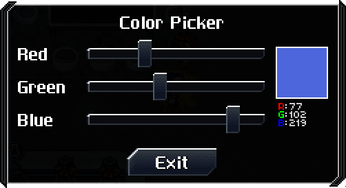
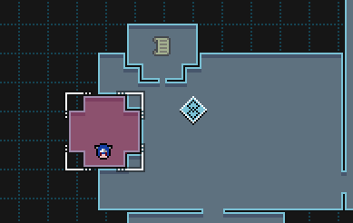
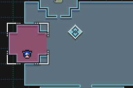

# EL's CrossCode Tweaks
*A collection of many small features combined into one convenient package.*

Contains additions/fixes that are helpful to both normal players and modders alike!

## [Click here to download!](https://github.com/EL20202/el-crosscode-tweaks/releases/latest)
***Note: Support will not be provided unless you are using the latest release. Merely downloading***

*Readme is guaranteed accurate up to version 0.7.4. See changelog for more details.*


&nbsp;

# Table of Contents
* **[Additions For Players](#for-players)**
  * [Arena Tweaks](#arena-tweaks)
  * [Assist Mode Changes](#assist-mode)
  * [NG+ Perks](#ng-perks)
  * [Uncapped Stats](#uncapped-stats)
  * [Trade Tracking](#trade-favoriting)
  * [Bug Fixes/Minor Additions](#bug-fixesother-miscellaneous-additions)
* **[Additions for Modders](#for-modders)**
  * [Action Steps](#action-steps)
  * [Color Picker](#color-picker)
  * [Custom Trophy Icons](#custom-trophy-icons)
  * [Modded Chests Tracking](#modded-chest-tracking)
  * [Custom Currencies](#custom-shop-currencies)
  * [Other Shop Additions](#other-shop-additions)
  * [Arena Additions](#arena-additions)
  * [Custom Map Utilities](#custom-map-utilities)
  * [Commands](#commands)
&nbsp;

&nbsp;

# For Players
## Arena Tweaks

#### HP Recovered Bonus


Adds an HP Recovery bonus to arena rounds to help offset the damage penalty. 

*Can be disabled in options.*

#### Arena Item Refunding


Any item that is used during an arena round will be automatically returned upon ending a round (regardless if you win, lose, or just exit the round in general).

*Can be disabled in options.*

#### Ascended Gear Scaling


Adds an option to allow any arena challenge to forcefully scale ascended gear to the cup level. The message will not display in situations where it doesn't make sense (such as cups which already scale or if you're not wearing ascended gear).

*Can be disabled in options.*

## Assist Mode


Adds an assist mode option to adjust timing windows of both perfect guards and perfect dashes.

**Note: Timing windows can be lowered without having assist mode considered to be enabled.**

## NG+ Perks


**Perfectionist** will make it so that any non-perfect guards will instantly cause a Guard Break. *However*, it also increases the perfect guard window threefold, while also automatically refreshing the shield on a perfect guard (effectively giving free Riposte).

Comparable to Dash Master, but for guarding instead of dashing.


Makes it so you cannot wear any equipment. Can you beat the game *naked*?

## Item Spawner

*Note: Must be enabled in the options menu to work.*


*Where to access the menu, once enabled*


*The menu itself. Note that not all menu elements may be present depending on what other mods you have installed.*

An item spawn menu, allowing you to add any item in the game to your inventory. 

Item search functionality requires [CCUILib](https://github.com/conorlawton/CCUILib) to be installed.

## Uncapped Stats
*Before*


*After*


Removes the visual stat cap present in many circumstances - allowing you to see what your stats really are! Allows the stat display to go up to 999999999, though it's incredibly unlikely for that limit ever to be reached. You can also have it so only attack will be able to go to a very, very high value - for whatever reasons you might want that.

**Warning**: If the standalone [Uncapped Stats](https://github.com/EL20202/cc-uncapped-stats) is installed, the this part of the mod will not function. Please remove the standalone version if installing this mod, as the standalone version will not be updated!

## Trade Favoriting

You can now track trades to see what items you need as you explore the world, just like how you can track quests!


*Note the `Set Favorites` button at the top of both.*


*Favorited trades will have a little star icon on the overworld.*

Once you have favorited a quest, you can cycle through them just like you would for favorite quests (by default `Q`/`E` or pressing the left/right sticks on controller). They show up after your favorited quests would.


## Bug Fixes/Other Miscellaneous Additions

* **Flash Step Fix**: Prior to CrossCode version 1.4.2-3, the modifier *Flash Step* had neglible effect on dash invincibility. This mod offers a fix to those who are playing older versions.
* **Element Aura Arena Bugfix**: Fixes the element aura not refreshing properly on starting a new round.
* **Arena Death Softlock Bugfix**: Fixes a potential softlock when restarting an arena round immediately after dying.
* **Skip Beginning Fix**: Fixes stat tracking not working at first if you use the NG+ perk "Skip Beginning". 
* **Ball Autofiring**: By holding the `F` key, you can automatically fire balls using mouse and keyboard - something previously exclusive to controller controls. (***NOTE***: requires [input-api](https://github.com/CCDirectLink/input-api) to function properly.)
* **Custom Map Name Fix**: Fixes custom mod map/area names as sometimes being displayed as `[object Object]` in save slots.
* **Arena Ascended Gear Scaling**: Fixes the ascended gear scaling modifier for arena cups/rounds to actually work properly for individual rounds (and not erroneously apply to some cups which might lack the scaling)

---
# For Modders
## Action Steps
Many new action steps that are designed to simplify the creation of various actions - both player and enemy!

**Note:** The examples will use comments as a way of filling in missing/"unneeded" data to illustrate how to use the action steps - though they WILL NOT work with comments in actual practice. Remember that JSON does not support comments, I'm merely using them here for demonstration purposes only. **HOWEVER**, if you are using a new version of CCLoader (one with Simplify v2.13.0 or higher) - JSON with Comments (which includes trailing commas) can and will be supported for all JSON files!

Table of Contents:
* Flow Control:
  * [`EL_ELEMENT_IF`](#el_element_if)
  * [`GOTO_LABEL_WHILE`](#goto_label_while)
  * [`SWITCH_CASE`](#switch_case)
  * [`WHILE_TRUE`](#while_true)
  * [`FOR_VAR`](#for_var)
  * [`FOR_ATTRIB`](#for_attrib)
  * [`FOR_PARTY_MEMBERS`](#for_party_members)
* Others
  * [`SET_ATTRIB_CURRENT_POS`](#set_attrib_current_pos)

### EL_ELEMENT_IF
Allows branching based on the element of the user. Note that this has only been tested on player configs - no guarantees it will work with enemies that can change elements!

*Example:*
```jsonc
{
  "type": "EL_ELEMENT_IF",
  "neutral": [
    /*other steps here if user is in neutral*/
  ],
  "heat": [
    /*other steps here if user is in heat*/
  ],
  "cold": [
    /*other steps here if user is in cold*/
  ],
  "shock": [
    /*other steps here if user is in shock*/
  ],
  "wave": [
    /*other steps here if user is in wave*/
  ]
}
```

### GOTO_LABEL_WHILE
Jumps to a named label if a condition is met. This works the same as the event step version - there was just no action step variant is all! That is corrected by this.

```jsonc
{
  "type": "GOTO_LABEL_WHILE",
  "name": "end",
  "condition": "tmp.condition"
},
/*...*/
{
  "type": "LABEL",
  "name": "end"
}
```

### SWITCH_CASE
Allows you to have switch which branch of steps is executed depending on a var's value. If a case named `_default` is present, that will be selected if there is no match.

***Important thing to keep in mind*** - if you're testing for number, due to how both JSON and JS work - you *must* represent the number as a string. Don't worry - it will otherwise work as you expect. 
```jsonc
{
  "type": "SWITCH_CASE",
  "var": "tmp.somevarhere", //the variable you are testing.
  "cases": {
    "1": [{
      /*steps here*/
    }],
    "2": [{
      /*steps here*/
    }],
    "3": [{
      /*steps here*/
    }]
  }
}
```

### WHILE_TRUE
Will repeatedly execute steps until the condition is no longer met.
```jsonc
{
  "type": "WHILE_TRUE",
  "condition": "tmp.something <= 2",
  "steps": [{
    /*step*/
  },{
    /*step*/
  },{
    /*step*/
  }]
}
```

### FOR_VAR
Will loop over a finite set of values, setting a variable to the relevant value on every loop.

```jsonc
{
  "type": "FOR_VAR",
  "values": [1,2,3,4,5],
  "varName": "tmp.something",
  "steps": [{
    /*step*/
  },{
    /*step*/
  },{
    /*step*/
  }]
}
```

### FOR_ATTRIB
Works functionally the same as `FOR_VAR`, but instead of setting a var it will set an attribute on the entity in question.

```jsonc
{
  "type": "FOR_ATTRIB",
  "values": [1,2,3,4,5],
  "attrib": "something",
  "steps": [{
    /*step*/
  },{
    /*step*/
  },{
    /*step*/
  }]
}
```

### FOR_PARTY_MEMBERS
Will loop through all party members (and optionally the player) and set the entity's temp target to them.

```jsonc
{
  "type": "FOR_PARTY_MEMBERS",
  "includePlayer": true,
  "steps": [{
    /*step*/
  },{
    /*step*/
  },{
    /*step*/
  }]
}
```

### SET_ATTRIB_CURRENT_POS
Sets an entity attribute to be the entity's current position.

```jsonc
{
  "type": "SET_ATTRIB_CURRENT_POS",
  "attrib": "attribute_name"
}
```

## Event Steps
A few new event steps are added for ease of making custom events.
For [`SWITCH_CASE`](#switch_case), [`WHILE_TRUE`](#while_true), and [`FOR_VAR`](#for_var) - see their Action Step counterparts, as the syntax and functionality is identical.

## Color Picker


Adds a simple color picker for whatever color-picking needs you want. Originally just made to allow customizing an aura's color, but I thought - you never know, someone else might need one too!

To open up the color picker through an event - simply have the below event step in some relevant event:
```jsonc
{
  "type": "OPEN_EL_COLOR_PICKER",
  "varPath": "el.colors.test",
  "title": {
      "en_US": "Color Picker"
  }
}
```
The `title` will be a langlabel of the gui popup, and if left blank it will default to just "Color Picker". `varPath` dictates which variable the color will be stored, and the variable will look something like this: `{"red": 243, "green": 143, "blue": 6, "colorString": "#F38F06"}`. All color components will be in the range of 0-255, inclusive.

## Custom Trophy Icons
To have your own custom trophy icons - it's quite simple! To start, make an image and put it in some place reasonable to be used for your trophy icons. Once you have that done, you can simply do this:

```js
sc.CUSTOM_TROPHY_SHEETS["your-mod-name-here"] = new ig.Image("media/gui/trophies/your-mod-name-here.png")
```

After you have done that, now you can assign your icons to `sc.TROPHY_ICONS`.

```js
sc.TROPHY_ICONS.YOUR_MOD_COOL_TROPHY = {
  cat: "GENERAL",
  hidden: false,
  index: -1, //indicates that you are using a custom trophy.
  sheet: "your-mod-name-here", //same as what you put in sc.CUSTOM_TROPHY_SHEETS
  customIndex: 2 //whatever index it is on your trophy sheet.
}
```

## Modded Chest Tracking
If you add custom chests to your mod to pre-existing areas, you may want them to be tracked in the areas in question (things like the chest counter and all that) - this mod makes it quite simple!

To register a custom chest, you just need to do something like this:

```js
sc.MapModel.inject({
  init() {
    this.parent(); //do not touch this line.

    this.registerChests(
      "autumn", //the area name the new chest is in
      //the rest of the parameters are strings associated with variables to track chest progress. 
      //can be pointing to the default chest_mapID format, or some other variable entirely. either work. 
      "maps.autumn/path-1.chest_206", //default chest variable
      "maps.autumn/path-1.my-cool-mods-custom-chest", //some other map var
      "cool_mod.autumn-chest-1" //some other var entirely
    )
  }
})
```
After this, you don't need to do *anything* else. This simple call will do everything you want it to do.

## Custom Shop Currencies
To create a new currency for use in shops - it's quite simple. To start, create an 11x11 icon to represent your currency. Once you have done that - you simply call this function:

```js
sc.modUtils.registerCurrency(
  "currencyName", //the internal name of the new currency you created.
  "media/gui/some-file-here.png", //the path to the file where your currency icon is.
  offX, offY //where the top left corner of your icon is.
)
```
You will also want to create a lang entry for the currency in the path `sc.gui.shop.currencyName`.

After you have done that - you can now access your currency with:
```js
sc.modUtils.currencies["currencyName"].name //the name of the currency.
sc.modUtils.currencies["currencyName"].get() //the current value
sc.modUtils.currencies["currencyName"].set(value) //set how much of the currency the player has.
sc.modUtils.currencies["currencyName"].add(value) //gives the player so much of the currency.
sc.modUtils.currencies["currencyName"].sub(value) //takes away some of the currency.
```

To get the value of it in a variable, you can use the path `currency.currencyName` to see how much the player currently has.

To use the currency in a shop, you do this in your shop's entry in `database.json`:
```jsonc
{
  "your-shop-here": {
    "name": {
      "en_US": "Your Shop Name Here"
    },
    "shopType": "BUY_AND_SELL",
    // ^- all vanilla stuff
    // v- new
    "currency": "currencyName",
    //more stuff below...
  }
}
```

## Other Shop Additions
Along with [custom currencies](#custom-shop-currencies), there is another key addition to shops - the ability to define custom shop sell pages! It is roughly the same format as the buy pages - just this time, it's for selling stuff! This was designed with custom currencies in mind, but it works fine with vanilla credits as well. 
```jsonc
{
  "your-shop-here": {
    "name": {
      "en_US": "Your Shop Name Here"
    },
    "shopType": "BUY_AND_SELL",
    // ^- all vanilla stuff
    // v- new
    "sellPages": [
      {
        "title": {
          "en_US": "Page 1"
        },
        "content": [
          {
            "item": 1,
            "price": 200
          },
          {
            "item": 2,
            "price": 500
          },
          {
            "item": "my-cool-custom-item",
            "price": 500000
          }
        ]
      },
      {
        "title": {
          "en_US": "Page 2"
        },
        "content": [
          {
            "item": "my-cooler-custom-item",
            "price": 5000000
          }
        ]
      },
      {
        "title": {
          "en_US": "Page 3"
        },
        //you can also just specify an item type to list everything in that category.
        "itemType": "ARM"
      }
    ],
    //more stuff below...
  }
}
```

## Arena Additions
There are two main additions to the arena for modders:

### Custom Cup Tracking
To make your cup be tracked in the statistics menu, just do this:

```js
sc.Arena.inject({
  init() {
    this.parent();
    //other stuff... perhaps registering your cup?
    this.trackedCups.push("your-cup-name-here");
  }
})
```

### Custom Arena Challenge Icons
To add your own custom arena challenges and associated icons - it's very simple! 

```js
//First, add a new icon entry here.
sc.ARENA_CHALLENGE_ICONS.YOUR_ICON_NAME_HERE = {
  src: "media/gui/your-mod-icon-sheet-here.png",
  //an 18x18 icon
  x: 112,
  y: 0,
  //a scaled down 10x10 version of the icon
  tinyX: 112,
  tinyY: 18
}

//Next, when you're adding your new challenge - when it comes to the icon, put in the name of the icon you created. For example:
sc.ARENA_CHALLENGES.MY_CHALLENGE = new sc.ArenaChallengeBase("YOUR_ICON_NAME_HERE")
```

This allows you to add in your own custom arena challenges with their own custom icons! For convenience's sake - there are 4 new challenges that come bundled with the mod. `NO_HEAT`, `NO_COLD`, `NO_SHOCK`, and `NO_WAVE` - which disable those elements in an arena round.

## Custom Map Utilities

Allows modders to much more easily add in custom maps to existing areas.

**Important Note**: This is not necessary if you're making your own custom area! This is intended solely for adding onto preexisting areas.

To get started, begin creating a patch file for the area in question. For this example, let's assume you have created a map in Rhombus Square.

File: `assets/data/areas/rhombus-sqr.json.patch`
```jsonc
[{
    "type": "ENTER",
    //substitute the second number with the appropriate value.
    "index": ["floors", 1, "maps"] 
},{
    "type": "ADD_ARRAY_ELEMENT",
    "content": {
        //all vanilla stuff, nothing new here.
        "path": "rhombus-sqr.my-cool-map",
        "name": {
            "en_US": "My Really Cool Map",
            "langUid": 10000
        },
        "offset": {
            "x": 0,
            "y": 0
        },
        "dungeon": "",

        //new stuff!
        "customMap": {
            //a 2D array detailing what your map will look like.
            //see below for details.
            "mapData": [
                [0, 1, 1, 1, 0],
                [1, 1, 1, 1, 1],
                [1, 1, 1, 1, 1],
                [1, 1, 1, 1, 1],
                [0, 1, 1, 1, 0]
            ],

            //where your map's top left corner should be placed.
            //can be negative, too!
            "offX": 18,
            "offY": 35,

            //a way to refer to your map in icons, connections, etc.
            "customName": "my-very-cool-map"
        }
    }
},
/* To be continued below... */
]
```

The `mapData` array will basically show what your map will look like. A `1` indicates that there is a tile there. A `0` (or any other value) indicates to leave things unchanged.

Now that we've made this patch - we can load up the game, and this is what our new map looks like!



Looks nice so far! Now, let's say we want to put a little connection on that map to the right map.

```jsonc
[
/* ...Continued from above. */
{
    "type": "EXIT",
    "count": 1
},{
    "type": "ENTER",
    "index": "connections"
},{
    "type": "ADD_ARRAY_ELEMENT",
    "content": {
        "tx": 22,
        "ty": 36,
        "dir": "HORIZONTAL",
        "size": 3,
        "map1": "my-very-cool-map", //use your 'customName' from above!
        "map2": 18
    }
}]
```

And if we load up the map in game...



We now have a nice lovely connection between these two maps! The same process applies to icons/landmarks, just with `map` instead of `map1` and/or `map2`. Note that the `customName` property only applies to that floor in question. Other floors will not know what it's referring to!

Enjoy mapping!

## Commands
This tweak pack contains a variety of commands which are designed to help modders with deving - designed to be easy to use through the console.

**Table of Contents**:
- [Adding Items](#adding-items)
- [Adding Credits](#adding-credits)
- [Teleporting](#teleporting)
- [Reloading Player Configs](#reloading-player-configs)
- [Reloading Effect Sheets](#reloading-effect-sheets)
- [Reloading an Enemy Type](#reloading-enemy-data)
- [Spawning Enemies](#spawning-enemies)
- [Reloading the Current Map](#reloading-the-current-map)
- [Reloading Area Files](#reloading-all-area-definitions)
- [Resetting Map Variables](#resetting-map-vars)
- [Resetting Temp Variables](#resetting-tmp-vars)

### Adding items
*command:* `cmd.addItem(id, amount?, hideMsg?)`

A safe version of `sc.model.player.addItem(...)`, not allowing you to add invalid items to the inventory (which can cause crashes).

Parameters:
- `id`: The item ID of the item you're trying to add. Can be a numeric ID or a string.
- `amount`: How many items to add to the inventory. Defaults to 1.
- `hideMsg`: Whether or not to show the message in the corner that you got a new item. Defaults to false.

### Adding credits:
*command:* `cmd.addCredits(amount)`
Gives money to the player - should be self explanatory.

Parameters:
- `amount`: How many credits to add.

### Teleporting
*command:* `cmd.teleport(mapName, marker?, destination?)`

A shorthand version of `ig.game.teleport()` designed for ease of use.

Parameters:
- `mapName`: The name of the map in question that you're teleporting to.
- `marker`: The marker in the map to teleport to.
- `destination`: An object containing information about where to place the player upon teleportation. (todo: elaborate on this)

### Reloading player configs
*command:* `cmd.reloadPlayerConfigs(reloadEffects?)`

A way to quickly reload all player/party member configs, so you don't have to reload the game to see a change in effect. By default, will also reload all effects.

Parameters:
- `reloadEffects`: Whether or not to reload the effect sheets as well. Defaults to true.

### Reloading effect sheets
*command:* `cmd.reloadEffectSheets()`

Will cause all effects to be reloaded, allowing you to see any changes to effect sheets to be reflected without reloading the game.

### Reloading enemy data:
*command:* `cmd.reloadEnemyType(enemyName, reloadEffects?)`

Will cause a specific enemy file to be reloaded from disk, allowing any changes to be reflected in-game without having to restart. By default, reloads all effects as well.

Parameters:
- `enemyName`: The path to the enemy type that will be reloaded.
- `reloadEffects`: Whether or not to reload the effect sheets as well. Defaults to true.

### Spawning enemies
*command:* `cmd.spawnEnemy(enemyName, levelOverride?, settings?, pos?)`

Spawns the enemy specified by `enemyName`, defaulting to the player's position. Enemy level can be conveniently overridden if desired, as well as any other miscellaneous settings that you desire to change.

Parameters:
- `enemyName`: The path to the enemy that will be spawned.
- `levelOverride`: The level the enemy should be spawned in as - defaulting to their standard level if not specified and/or left as `undefined`/`null`.
- `settings`: An object containing the information related to the enemy type. 
- `pos`: A vec3 containing the position to spawn the enemy, defaulting to the player's position.

### Reloading the current map
*command:* `cmd.reloadMap()`

Reloads the current map the player is in, spawning you at the exact same position as you were pre-reloading.

### Reloading all area definitions
*command:* `cmd.reloadAreas()`

Reloads all area files. Primarily intended for those adding custom maps to areas via [the custom map utilities](#custom-map-utilities), but can be used anywhere.

### Resetting map vars
*command:* `cmd.resetMapVars(includeTmp?, reloadMap?)`

Clears all the variables associated with the current map, and if specified the temporary variables in the current map as well.

Parameters:
- `includeTmp`: Whether or not to include the `tmp` namespace in map clearing as well.
- `reloadMap`: Whether the map should be reloaded or not automatically (required for some puzzle elements to be reset).

### Resetting tmp vars
*command:* `cmd.resetTmpVars()`

Clears all temporary variables which are found in the `tmp` namespace.

